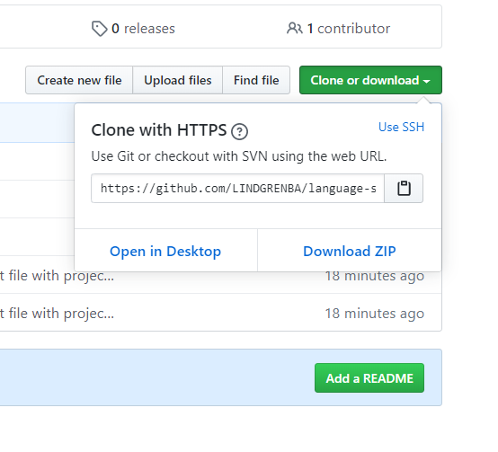

# Address Book

#### An Object Oriented Programming exercise for Epicodus, 06.15.2020

## By Brittany Lindgren & Teresa Rosinskin & Micheal Hansen

## Description

This project will store your contacts so that you can look up your best friend's digits any time you need to call!

## Setup/Installation Requirements

1. Follow this [link to the project repository](https://github.com/LINDGRENBA/address-book) on GitHub.

2. Click on the "Clone or download" button to copy the project link.
 

3. If you are comfortable with the command line, you can copy the project link and clone it through your commad line with the command `git clone`. Otherwise, I recommend choosing "**Download ZIP**". 

4. Once the ZIP file has finished downloading, you can right click on the file to view the zip folder in your downloads. 

5. Right click on the project ZIP folder that you have just downloaded and choose the option "**Copy To...**", then choose the location where you would like to save this folder. 

6. Navigate to the final location where you have chosen to save the project folder.

7. To view the code itself, right click, choose "open with..." and open using a text editor such as VS Code or Atom, etc.

#### Additional Setup/Installation Notes:

* It is not necessary to run a server to view this project.

* No additional code is necessary to view this project.

## Specifications

#### Behavior: Program will create an address book
* Input: No input
* Output: addressBook object {contacts = [], currentID = 0}

#### Behavior: Address book can accept Contact objects
* Input: Contact("John Doe")
* Output: {contacts=[("John Doe")], currentID = 0}

#### Behavior: Program will assign a unique ID to contacts as they are added
* Input: Contact("John Doe"), Contact("Betty Smith")
* Output: {contacts = [(1, John Doe), (2, Betty Smith)], currentID = 3}, <!--this is an addressBook object, currentID refers to what will be assigned to the next one added>

#### Behavior: Address book can search for contacts based on ID
* Input: 1
* Output: (1, John Doe, phone number)

#### Behavior: Address book can delete a contact based on an ID
* Input: 1
* Output: (1, John Doe) is deleted from Contacts array

#### Behavior: Contact Objects can add contact information
* Input: John Doe + "email address: john@doe.com"
* Output: (1, John Doe, "email address: john@doe.com")

#### Behavior: Contact Objects can delete information
* Input: John Doe - "email address: john@doe.com"
* Output: (1, John Doe)

#### Behavior: Program will display the information for a specific contact object when a contact is clicked
* Input: User clicks "John Doe"
* Output: <li>John Doe</li>, <li>360-555-6677<li>

## Known Bugs

#### Not Yet Resolved
* There are no known bugs at this time.
#### Resolved
* 

## User Interface, To Resolve
#### Not Yet Resolved (on Styling Branch)
* The front end is not yet connected to the UI and business logic
#### Resolved
* 

## Support and contact details

Please feel free to contact me through GitHub (username: LINDGRENBA) with any questions, ideas or concerns.  

## Technologies Used

* HTML5
* CSS3
* Bootstrap v-3.3.7
* JavaScript
* jQuery v-3.5.0
* Visual Studio Code 
* Git and Git BASH 

### License

*This site is licensed under the MIT license.*

Copyright (c) YEAR **_Brittany Lindgren & Teresa Rosinski & Micheal Hansen_**